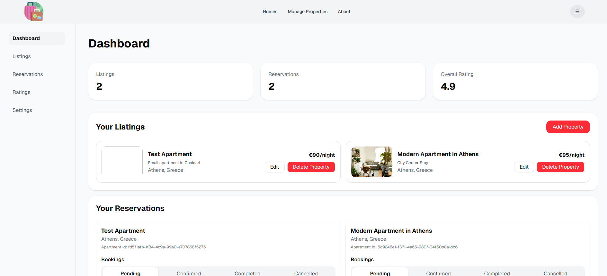
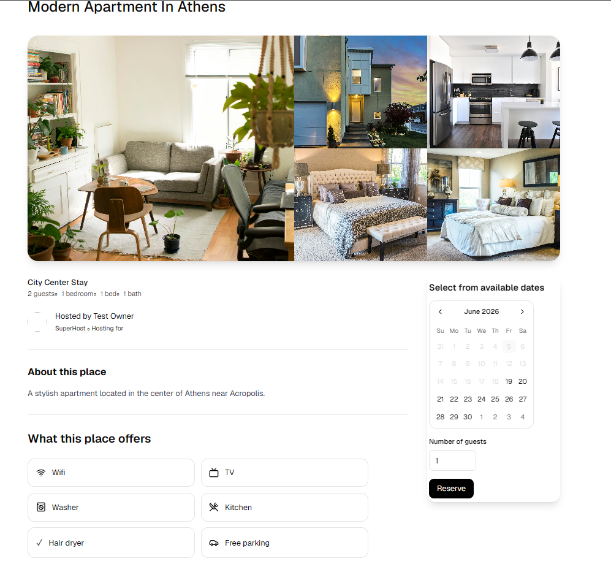
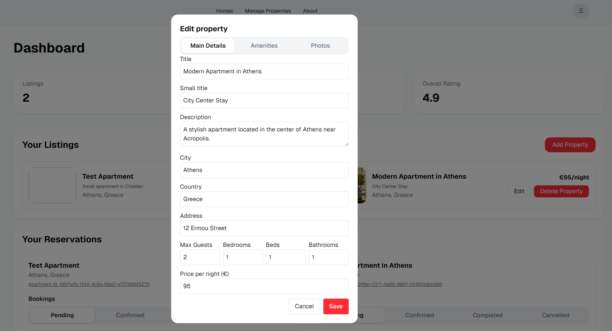
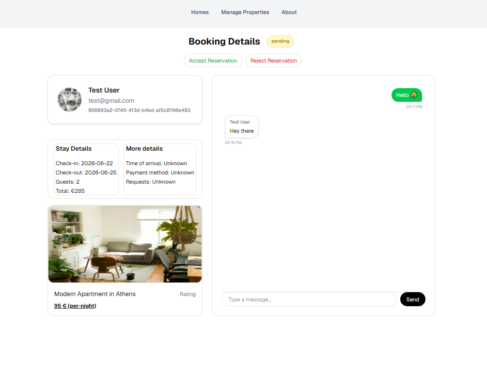

# StayFinder

StayFinder is a full-stack property booking web application inspired by platforms such as Airbnb. The application allows users to browse properties, make reservations, communicate with property owners, and manage bookings. Property owners can create and manage listings, view reservations, and interact with guests through an integrated messaging system.

##🚀 Live Demo

👉 https://booking-xtu7.vercel.app

## Project Status

⚠️ This project is currently under active development and is not yet complete.

Some features may be partially implemented, unfinished, or subject to change. The application is being developed as part of a university dissertation project and serves as a demonstration of modern web application development using Next.js and Supabase.

## Test Accounts

### Host Account

Email: testowner@gmail.com

Password: test123

### Guest Account

Email: test@gmail.com

Password: test123

## Screenshots

### Home Page

### Property Details

### Editing Properties

### Booking Management

## Features

### Guest Features

* User registration and authentication
* Browse available properties
* Search properties by location
* View detailed property information
* Create bookings
* View booking history
* Real-time messaging with property owners

### Host Features

* Create property listings
* Edit and delete properties
* Manage bookings
* Accept or reject reservation requests
* Communicate with guests through chat
* View property and booking information

### Technical Features

* Next.js App Router
* Supabase Authentication
* Supabase Database
* Real-time messaging using Supabase Realtime
* Responsive UI with Tailwind CSS
* Role-based functionality (Guest / Host)

## Technologies Used

* Next.js
* React
* Tailwind CSS
* Supabase
* PostgreSQL
* Lucide React

## Working Locations

The application currently contains sample properties and booking data for the following locations:

* Athens
* Thessaloniki
* Halkidiki
* Kavala

Additional locations may be added in future updates.

## Known Issues / Missing Features

The following functionality is still being developed:

* Improved booking validation
* Booking cancellation workflow
* User profile enhancements
* Notification system
* Image upload improvements
* Additional property filtering
* Enhanced mobile responsiveness

## Disclaimer

This project was developed for educational purposes. It is not intended for production use in its current state.

## Author

Developed by Rafael Walder.
